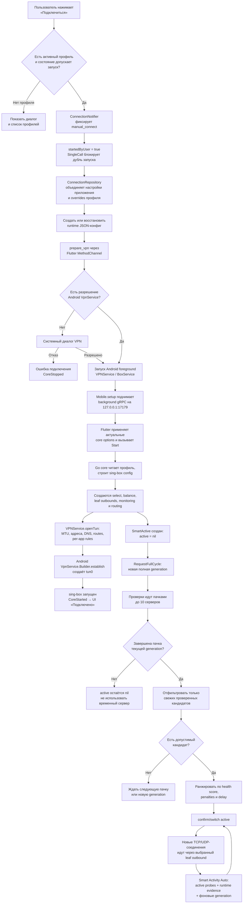
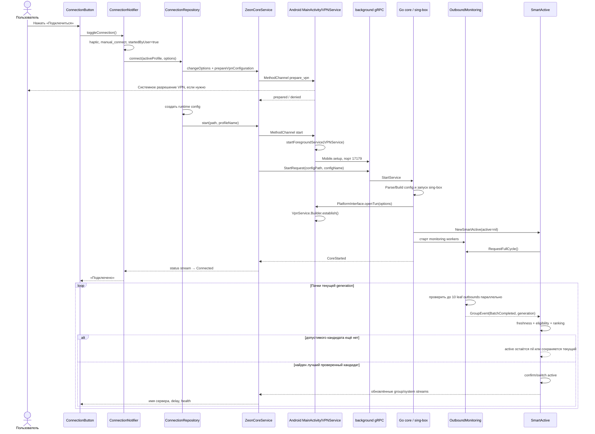
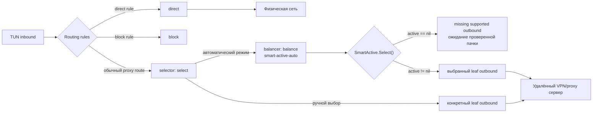
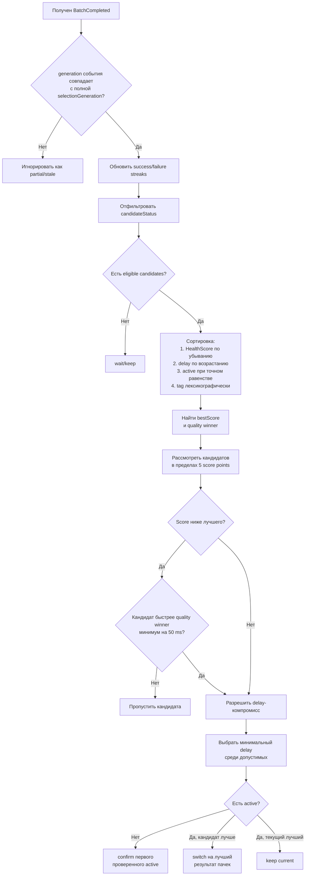
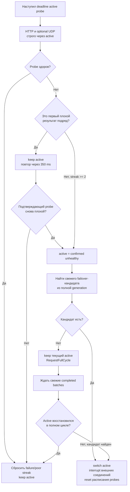

# Работа VPN и Smart Active Auto

> Актуально для текущей реализации на 20 июля 2026 года. Документ описывает Android/TUN-сценарий: от нажатия «Подключиться» до пакетного автовыбора сервера и дальнейшей работы Smart Activity Auto.

## 1. Область действия и основные термины

В стандартных мобильных настройках приложение использует:

- режим сервиса `tun`;
- стратегию балансировщика `smart-active-auto`;
- период полного фонового URL-теста 3 минуты;
- группу `select` как главный селектор маршрута;
- группу `balance` как автоматический балансировщик серверов.

Профиль может переопределить настройки. Если выбрана другая стратегия балансировщика, описанная ниже логика Smart Active не применяется.

Основные термины:

- **leaf outbound** — конкретный сервер из профиля: VLESS, VMess, Trojan, Hysteria и т. п.;
- **`select`** — верхний селектор, который выбирает автоматическую группу `balance` либо конкретный сервер вручную;
- **`balance`** — автоматическая группа, внутри которой работает Smart Active Auto;
- **active** — единственный конкретный leaf outbound, через который Smart Active сейчас отправляет новые соединения;
- **generation** — номер одного согласованного цикла проверки серверов;
- **batch** — пачка серверов одной generation, проверяемая параллельно. По умолчанию размер пачки — до 10 серверов;
- **completed batch** — пачка, в которой завершились все запущенные проверки;
- **bootstrap Smart Active** — стартовая фаза нового экземпляра Smart Active. Она не связана с bootstrap-импортом профиля приложения;
- **Smart Activity Auto** — проверки уже выбранного active-сервера и реакция на реальные ошибки/успехи пользовательских соединений.

## 2. Общая блок-схема



Ключевой инвариант схемы: `active` не получает значение при создании Smart Active. Ни первый элемент профиля, ни старый cache, ни частичная незавершённая проверка не становятся временным сервером.

## 3. Последовательность компонентов



## 4. Что происходит во Flutter после нажатия

### 4.1. UI-гейт

`ConnectionButton` разрешает нажатие только для устойчивого состояния `Connected`, `Disconnected` либо ошибки. Во время `Connecting` и `Disconnecting` повторное нажатие не запускает ещё один lifecycle-вызов.

При подключении UI:

1. Проверяет наличие active profile. Если профиля нет, показывает диалог и открывает список профилей.
2. При необходимости показывает предупреждение об экспериментальной функции.
3. Вызывает `ConnectionNotifier.toggleConnection()`.

### 4.2. ConnectionNotifier

Notifier:

1. Даёт haptic feedback.
2. Запоминает действие `manual_connect` для диагностики неожиданных остановок.
3. Устанавливает `Preferences.startedByUser = true`.
4. Пропускает запуск через `SingleCall`, поэтому параллельные connect/disconnect не накладываются друг на друга.
5. Получает актуальный active profile и вызывает `ConnectionRepository.connect()`.

Состояния UI получаются не из самой кнопки, а из потока core:

| Core status | ConnectionStatus | Отображение |
|---|---|---|
| `CoreStopped` | `Disconnected` | «Нажмите для подключения» |
| `CoreStarting` | `Connecting` | «Подключение…» |
| `CoreStarted` | `Connected` | «Подключено» |
| `CoreStopping` | `Disconnecting` | «Отключение…» |

### 4.3. Настройки и runtime-конфиг

`ConnectionRepository` перед запуском:

1. Объединяет глобальные настройки с overrides профиля.
2. Проверяет WARP license, если WARP включён.
3. Передаёт options в foreground/background core.
4. Читает сохранённый JSON профиля.
5. Если сохранённый файл не является корректным сгенерированным JSON, повторно валидирует/генерирует его и сохраняет исправление.
6. Создаёт отдельный runtime-файл, путь которого передаётся Android service и Go core.

## 5. Android VPN service и создание TUN

### 5.1. Разрешения

`prepare_vpn` идёт через Flutter `MethodChannel` в `MainActivity.prepareVpn()`.

- Для VPN-режима вызывается `VpnService.prepare()`.
- Если разрешение ещё не выдано, Android показывает системный диалог.
- Отказ возвращается как `missingVpnPermission`; core не запускается.
- На Android 13+ отдельно проверяется permission уведомлений foreground service. Это не заменяет VPN permission.

Разрешение проверяется ещё раз непосредственно перед запуском native service. Это защищает от отзыва permission между подготовкой и фактическим стартом.

### 5.2. Foreground service и gRPC

`MainActivity.startService()` запускает `VPNService` как foreground service. Внутри `BoxService`:

1. Состояние становится `Starting`.
2. Запускается монитор default network.
3. Применяется настройка memory limit.
4. `Mobile.setup()` поднимает background Go/gRPC endpoint на `127.0.0.1:17179`.
5. Flutter подключает listeners статуса и логов, повторно передаёт последние core options.
6. Flutter вызывает gRPC `Start` с путём runtime-конфига.

Foreground endpoint `127.0.0.1:17178` создаётся при общей инициализации приложения и используется для управляющих операций. Рабочий VPN core обслуживается background endpoint на порту `17179`.

### 5.3. VpnService.Builder

Во время старта sing-box вызывает Android `PlatformInterface.openTun()`.

`VPNService.openTun()`:

1. Проверяет VPN permission.
2. Создаёт `VpnService.Builder`.
3. Устанавливает session name и MTU.
4. Добавляет IPv4/IPv6-адреса TUN.
5. Добавляет DNS и маршруты; на новых Android применяет также исключённые routes.
6. Применяет per-app include/exclude rules.
7. По умолчанию исключает само приложение из VPN, чтобы управляющий трафик не зацикливался.
8. При необходимости устанавливает Android HTTP proxy.
9. Вызывает `builder.establish()` и передаёт файловый дескриптор TUN обратно в Go core.

Сокеты, которыми core выходит в физическую сеть, защищаются через `VpnService.protect(fd)`, поэтому они не возвращаются обратно в `tun0`.

## 6. Как строится маршрут внутри core

Для профиля с несколькими серверами config builder создаёт примерно такую структуру:



Важные исключения:

- если в профиле только один сервер, `balance` не создаётся, а `select` указывает прямо на единственный leaf;
- если пользователь вручную выбрал конкретный сервер в `select`, трафик обходит `balance`, пока снова не выбран `balance`;
- routing rules могут направить отдельный трафик в `direct`, `block`, WARP или другой outbound, минуя Smart Active;
- действие «перепроверить серверы» из Android notification возвращает `select` на `balance`, если ранее был ручной выбор, а затем запускает URL-тест всей группы.

## 7. Старт Smart Active без provisional active

При создании `SmartActive`:

```text
active     = nil
confirmed  = false
bootstrap  = true
decision   = wait / startup_waiting_for_verified_batch
```

`Now()` возвращает пустую строку, а `Select()` возвращает `nil`, пока не появился подтверждённый кандидат.

Это означает:

- первый сервер профиля не назначается только из-за позиции;
- foreign/RU policy не используется для выбора непроверенного fallback;
- cache от прошлого запуска не становится active;
- одиночная частичная проверка не формирует стартовый active;
- если все серверы провалили проверки, active остаётся пустым;
- до первого проверенного active попытка открыть соединение через `balance` завершается `missing supported outbound`. Приложение или сетевой клиент может повторить запрос после появления active.

`CoreStarted` означает, что core и TUN подняты. Это отдельный факт от наличия `SmartActive.active`. Обычно первая пачка завершается рядом со стартом core, но архитектурно эти события не считаются одним и тем же.

## 8. Полная generation и пачки

### 8.1. Зачем нужна generation

После `Balancer.PostStart()` вызывается `RequestFullCycle()`. Это принудительно включает в цикл все leaf outbounds, даже если в cache есть недавние результаты.

Monitoring выдаёт новый `cycleID` и перед запуском workers сбрасывает каждый сервер одной cohort:

- `CheckGeneration = cycleID`;
- `URLTestStatus = checking`;
- `CombinedReady = false`;
- delay/готовность текущей проверки очищаются;
- накопленные runtime, real-user, stability, volatility и policy penalties сохраняются.

Так Smart Active отличает согласованный полный цикл от одиночного ping и от результатов прошлого запуска.

### 8.2. Как формируются пачки

По умолчанию monitoring использует 10 workers. Список targets делится на последовательные пачки размером до 10:

1. Серверы одной пачки запускаются параллельно.
2. Monitoring ждёт terminal outcome каждого запущенного target.
3. Результаты применяются к history только при совпадении generation.
4. После завершения всей пачки публикуется `GroupEvent` с `BatchCompleted=true`, `Generation` и `BatchNumber`.
5. Только такое событие разрешает Smart Active сделать пакетный выбор.
6. Затем запускается следующая пачка.

Очередность запуска targets может учитывать старые задержки, чтобы раньше проверить вероятно быстрые серверы. Эта очередность влияет только на момент получения evidence, но не является критерием ранжирования и не назначает первый элемент автоматически.

### 8.3. Что считается завершённым результатом

После основной URL-проверки history получает:

- `PingReady = true`;
- `QualityReady = true`;
- `SpeedReady = true`;
- `CombinedReady = true`;
- `Success`, `Delay`, `ErrorType`, `HealthScore`;
- текущий `CheckGeneration`;
- `IsFromCache = false`.

UDP probe является дополнительным сигналом и не блокирует `CombinedReady`. Он может позже добавить `UDPPenalty`, loss и jitter. По умолчанию UDP probe выполняется только для ограниченного top-N кандидатов, если endpoint и функция доступны.

Если на выбранном test URL не сработал ни один сервер, monitoring может повторить stage со следующим URL из настроенного списка. Если в stage есть хотя бы один успех, generation завершается с имеющимися успехами и отказами.

## 9. Фильтр допустимого кандидата

Перед ранжированием `candidateStatus()` требует одновременно:

1. Tag принадлежит текущему `balance`.
2. History существует.
3. Известна текущая полная generation.
4. `history.CheckGeneration` точно совпадает с ней.
5. Timestamp не старше момента создания текущего Smart Active.
6. Результат не пришёл из cache.
7. `Success = true`.
8. Нет transport error.
9. `URLTestStatus = success`.
10. `CombinedReady = true`.
11. `PolicyPenalty < 50`.
12. `HealthScore >= 35`.
13. Health state не равен `BAD` или `CRITICAL`.

Если хотя бы одно условие не выполнено, сервер остаётся только диагностическим результатом и не может стать active.

## 10. Расчёт HealthScore

HealthScore ограничен диапазоном `0..100`.

```text
HealthScore = DelayScore
              - FreshnessPenalty
              - RuntimePenalty
              - RealUserPenalty
              - VolatilityPenalty
              - UDPPenalty
              - PolicyPenalty
```

Для неуспешной проверки базовый score дополнительно ограничивается cap, зависящим от типа ошибки. Неуспешный сервер всё равно не проходит `candidateStatus()`.

### 10.1. Базовый score задержки

| Delay | DelayScore |
|---:|---:|
| `0` или `>= 65535 ms` | 0 |
| `<= 80 ms` | 100 |
| `81..150 ms` | 90 |
| `151..250 ms` | 75 |
| `251..400 ms` | 60 |
| `401..700 ms` | 40 |
| `701..1000 ms` | 25 |
| `> 1000 ms` | 10 |

### 10.2. Penalties

| Сигнал | Максимум | Смысл |
|---|---:|---|
| Freshness | 30 | cache и возраст результата |
| Runtime | 25 | transport errors реальных соединений |
| Real user | 30 | подтверждённые проблемы пользовательских сессий |
| Volatility | 25 | нестабильность delay и повторяющиеся проблемы |
| UDP | 15 | loss/jitter/недоступность UDP probe |
| Policy | 50 | политика региона/сервера |

Текущая policy-логика назначает российскому серверу penalty `45`, определяя его по country code или tag. Это не абсолютная блокировка (`45 < 50`), но такой сервер должен компенсировать penalty качеством и задержкой.

HealthScore использует только транспортные метаданные. Содержимое пакетов, URL пользователя, домены и payload для score не анализируются.

## 11. Выбор из завершённых пачек



### 11.1. Стартовая фаза

На старте для кандидата не требуется накопленная серия из двух прошлых успехов: свежая успешная completed batch уже является достаточным первым evidence.

После первой выбранной пачки Smart Active продолжает режим best-so-far. Поэтому следующие пачки той же generation могут последовательно улучшать active. Это не provisional fallback: каждый такой сервер уже имеет свежий terminal result текущей полной generation.

Когда все серверы полной cohort получили terminal result, `bootstrap=false`.

### 11.2. Независимость от позиции

При полном равенстве score и delay:

- если active уже есть, он сохраняется;
- до первого active выбирается лексикографически меньший tag.

Изменение порядка одинаковых серверов в исходном профиле поэтому не изменяет победителя.

### 11.3. Пакетные обновления после старта

После bootstrap completed batch обычно требует от нового кандидата не менее двух чистых успешных probes и отсутствия failure streak. Если текущий active имеет состояние `BAD` или `CRITICAL`, достаточно одного чистого успеха кандидата.

Переключения best-so-far внутри одной свежей generation не помещают предыдущего победителя в двухминутный avoid-list. Иначе более поздняя пачка не смогла бы доказать, что её сервер действительно лучше.

## 12. Обычные правила переключения после bootstrap

Состояние active рассчитывается так:

| State | Условие |
|---|---|
| `CRITICAL` | critical error, degradation `>=75` либо неуспех с real-user penalty `>=20` |
| `BAD` | неуспех, degradation `>=55` или score `<25` |
| `DEGRADED` | degradation `>=30`, runtime+real-user `>=18` или score `<45` |
| `SUSPECT` | degradation `>=10`, runtime+real-user `>=8`, score `<60` или volatility `>=10` |
| `GOOD` | ничего из перечисленного |

Пока текущий active находится в `checking` и нет критической runtime-проблемы, он сохраняется: незавершённая проверка не вызывает переключение.

Основные пороги:

- разница delay `<=10 ms` считается минимальной — сохраняется текущий active;
- кандидат сравнимого качества, отстающий не более чем на 5 score points, может победить, если быстрее минимум на `50 ms`;
- кандидат с преимуществом score минимум `8` может заменить `GOOD` active при чистом evidence;
- для `DEGRADED` применяется минимальное преимущество score `8`;
- для `SUSPECT` требуется преимущество score `14`;
- `BAD/CRITICAL` разрешают emergency-кандидата после одного чистого успеха;
- стабильность кандидата не должна быть хуже текущей более чем на 10 points, а volatility — выше более чем на 4 points в проверках `betterEnough`;
- после обычного switch предыдущий active помещается в avoid-list на 2 минуты. Вернуться раньше можно только после достаточного чистого recovery evidence.

Также текущий сервер сохраняется, если реальные пользовательские сессии показывают заметно лучшую стабильность, а преимущество лабораторного кандидата недостаточно.

## 13. Smart Activity Auto: контроль active-сервера

После появления или смены active отдельный scheduler проверяет только его:

```text
0, 10, 20, 30, 40, 50, 60 секунд от момента выбора,
затем один раз в минуту.
```

Active probe:

- выполняет один небольшой HTTP URL-test строго через active;
- имеет hard timeout не более 3 секунд;
- при настроенном UDP endpoint отправляет не более 3 UDP-пакетов размером до 128 байт;
- не запрашивает IP metadata;
- не перезаписывает full-generation history кандидатов;
- служит быстрым сигналом здоровья именно маршрута, который несёт пользовательский трафик.

### 13.1. Реакция на probe



Hard failure — это неуспех, transport error, нулевая/невалидная задержка. Poor quality — delay `>=1500 ms` либо UDP loss `>=80%`, когда UDP probe доступен.

Один плохой sample никогда не переключает сервер: требуется подтверждение вторым probe.

Failover-кандидат должен:

- пройти обычный `candidateStatus`;
- иметь минимум один clean success и нулевой failure streak;
- не находиться в avoid-list;
- быть лучшим по score, затем delay, затем tag.

Если подходящего кандидата нет, алгоритм не выбирает первый сервер и не использует непроверенный fallback. Он сохраняет текущий active как последний рабочий маршрут и запрашивает новую полную generation.

## 14. Evidence от реального трафика

Smart Active получает транспортные сигналы от реальных соединений:

- успешный handshake уменьшает `RealUserPenalty` и degradation, увеличивает stability;
- transport error классифицируется (`timeout`, `reset`, `refused`, DNS/TLS/QUIC error и т. д.), увеличивает runtime/real-user penalties и degradation, уменьшает stability;
- чистый download постепенно восстанавливает репутацию сервера;
- повторяющийся upload без download после окна 8 секунд считается возможным stall. После двух samples добавляются penalties и запускается validation probe;
- payload, домены, URL и содержимое трафика не записываются — учитываются только outcome и агрегированные byte counters.

При ошибке текущий result помечается invalid и может быть поставлен в priority validation. Эти данные участвуют в следующем решении Smart Active вместе с фоновыми probes.

## 15. Фоновые полные циклы

На mobile стандартный интервал — 3 минуты. Monitoring активен, пока сервис используется; idle timeout конфигурируется как три интервала, то есть обычно 9 минут без активности.

Каждый фоновый цикл:

1. Получает новый generation ID.
2. Выбирает устаревшие/invalid targets; принудительный `RequestFullCycle` включает все leaf outbounds.
3. Сбрасывает состояния выбранной cohort.
4. Проверяет серверы пачками.
5. После каждой completed batch даёт Smart Active возможность сравнить best-so-far.
6. После полной generation применяет state/hysteresis/evidence правила.
7. Сохраняет history в cache для UI и диагностики, но новый экземпляр Smart Active не использует cache как стартовый active.

## 16. Что происходит при смене active

Когда `confirmActive()` или `switchTo()` меняет сервер:

1. `SmartActive.Now()` начинает возвращать новый leaf tag.
2. Пишутся `[SmartActiveDecision]`, `[AutoDecision]` и `[ActiveServerChanged]`.
3. Если `InterruptExistConnections=true`, interrupt group закрывает существующие внешние TCP/UDP-соединения этой группы.
4. Приложения повторно открывают соединения, и новые подключения уже идут через новый active.
5. Active probe schedule сбрасывается и немедленно проверяет новый сервер.
6. gRPC streams `outboundsInfo`, `mainOutboundsInfo` и system stats передают выбор Flutter UI.

Smart Active хранит один active для группы, а не выбирает новый сервер для каждого запроса. Это отличает его от Round Robin.

## 17. Как UI показывает active

`ActiveProxyNotifier` объединяет три потока:

- active groups из `mainOutboundsInfo`;
- selector/group snapshot из `outboundsInfo`;
- system stats с реальным outbound tag.

Если в `select` выбран `balance`, UI отображает `Автовыбор • <реальный leaf>`. Имя, delay и health относятся к leaf outbound, хотя выбранным элементом верхнего selector остаётся `balance`.

Для защиты от визуального мерцания UI может временно удерживать последний пригодный display snapshot. Это только представление: оно не записывает `SmartActive.active` и не участвует в выборе. Источник истины для маршрутизации — `SmartActive.Select()` внутри core.

## 18. Ручная перепроверка и ручной сервер

### Ручной сервер

Выбор leaf в UI вызывает gRPC `SelectOutbound(groupTag, outboundTag)`. Верхний `select` начинает направлять трафик прямо на этот leaf; Smart Active перестаёт определять рабочий маршрут, пока снова не выбран `balance`.

### Ручная перепроверка

Полный manual refresh:

1. Создаёт новую generation для всех targets группы.
2. Проверяет их пачками.
3. Помечает событие как `user_refresh`.
4. Smart Active выбирает лучший свежий rank-1, но сохраняет текущий сервер при минимальном точном tie или если кандидат имеет runtime/UDP penalties.
5. Частичный ping одного сервера не считается полной перепроверкой всей группы и не может назначить стартовый active.

## 19. Пограничные сценарии

| Сценарий | Поведение |
|---|---|
| Нет active profile | Connect не запускается, открывается выбор профиля |
| VPN permission отклонён | Core остаётся stopped, показывается ошибка permission |
| Runtime config повреждён | Приложение пытается регенерировать и валидировать его до старта |
| Один сервер в профиле | `select` выбирает leaf напрямую, `balance` не создаётся |
| Несколько серверов, все tests failed | `SmartActive.active` остаётся `nil` |
| Есть только cache прошлого запуска | Cache может отображаться в UI, но не становится active |
| Завершился один target частичной generation | Стартовый выбор не меняется |
| Batch event имеет другую generation | Событие игнорируется |
| Два кандидата полностью равны | Сохраняется active; до первого выбора используется tag, не позиция |
| Один плохой active probe | Active сохраняется, выполняется confirmation probe |
| Два плохих active probes, свежего кандидата нет | Active сохраняется, запускается `RequestFullCycle` |
| Найден подтверждённый failover | Active меняется, внешние соединения прерываются и пересоздаются |
| Пользователь выбрал leaf вручную | Трафик обходит `balance` |
| Пользователь отключает VPN | gRPC/core останавливаются, TUN fd закрывается, foreground service завершается |

## 20. Диагностические события

Для трассировки полного сценария используются маркеры:

| Маркер | Что показывает |
|---|---|
| `[SmartActiveLifecycle]` | запуск, initial snapshot, user refresh |
| `[CheckGenerationStarted]` | номер generation и размер cohort |
| `[OutboundCheckReset]` | сброс конкретного сервера перед generation |
| `[OutboundCheckStage]` | checking/completed/failed для ping, quality и UDP |
| `[SmartActiveFreshness]` | готовность result к ranking |
| `[MonitoringBatchCompleted]` | завершение пачки |
| `[CheckGenerationCompleted]` | итог всей generation |
| `[SmartActiveState]` | state, score и penalties active |
| `[SmartActiveDecision]` | `wait`, `keep`, `confirm`, `switch` и причина |
| `[SmartActiveRanking]` | порядок кандидатов |
| `[ActiveServerChanged]` | фактическая смена active |
| `[SmartActiveProbe]` | отдельная проверка active |
| `[SmartActiveTrafficHealth]` | runtime error, stall или clean traffic evidence |

## 21. Инварианты текущей реализации

1. Нет выбора сервера только по позиции в списке.
2. Нет provisional active на время первой проверки.
3. Нет возврата cache-сервера как стартового active.
4. Стартовый кандидат обязан иметь свежий completed result полной generation.
5. Partial/stale generation не может заменить текущий выбор.
6. Failed/BAD/CRITICAL сервер не может стать кандидатом.
7. Один плохой active probe не вызывает switch.
8. При отсутствии failover-кандидата алгоритм не подставляет непроверенный сервер.
9. Точное равенство разрешается независимо от порядка списка.
10. UI snapshot не управляет core selection.

## 22. Карта исходного кода

Основные точки реализации:

- UI-кнопка: [`lib/features/home/widget/connection_button.dart`](../lib/features/home/widget/connection_button.dart)
- lifecycle подключения: [`lib/features/connection/notifier/connection_notifier.dart`](../lib/features/connection/notifier/connection_notifier.dart)
- подготовка options/runtime config: [`lib/features/connection/data/connection_repository.dart`](../lib/features/connection/data/connection_repository.dart)
- Flutter mobile core bridge: [`lib/zeoncore/core_interface/core_interface_mobile.dart`](../lib/zeoncore/core_interface/core_interface_mobile.dart)
- start/stop и gRPC streams: [`lib/zeoncore/zeon_core_service.dart`](../lib/zeoncore/zeon_core_service.dart)
- Android MethodChannel: [`android/app/src/main/kotlin/com/zeon/zeon/MethodHandler.kt`](../android/app/src/main/kotlin/com/zeon/zeon/MethodHandler.kt)
- permissions и foreground start: [`android/app/src/main/kotlin/com/zeon/zeon/MainActivity.kt`](../android/app/src/main/kotlin/com/zeon/zeon/MainActivity.kt)
- Android service lifecycle: [`android/app/src/main/kotlin/com/zeon/zeon/bg/BoxService.kt`](../android/app/src/main/kotlin/com/zeon/zeon/bg/BoxService.kt)
- TUN creation: [`android/app/src/main/kotlin/com/zeon/zeon/bg/VPNService.kt`](../android/app/src/main/kotlin/com/zeon/zeon/bg/VPNService.kt)
- Go core start: [`hiddify-core/v2/hcore/start.go`](../hiddify-core/v2/hcore/start.go)
- config groups `select`/`balance`: [`hiddify-core/v2/config/builder.go`](../hiddify-core/v2/config/builder.go)
- batch monitoring: [`hiddify-core/hiddify-sing-box/common/monitoring/outbound_monitoring.go`](../hiddify-core/hiddify-sing-box/common/monitoring/outbound_monitoring.go)
- health score: [`hiddify-core/hiddify-sing-box/common/urltest/health.go`](../hiddify-core/hiddify-sing-box/common/urltest/health.go)
- balancer integration: [`hiddify-core/hiddify-sing-box/protocol/group/balancer/balancer.go`](../hiddify-core/hiddify-sing-box/protocol/group/balancer/balancer.go)
- Smart Active selection: [`hiddify-core/hiddify-sing-box/protocol/group/balancer/smart_active.go`](../hiddify-core/hiddify-sing-box/protocol/group/balancer/smart_active.go)
- active failover rules: [`hiddify-core/hiddify-sing-box/protocol/group/balancer/smart_active_probe.go`](../hiddify-core/hiddify-sing-box/protocol/group/balancer/smart_active_probe.go)
- active probe scheduler: [`hiddify-core/hiddify-sing-box/protocol/group/balancer/active_monitor.go`](../hiddify-core/hiddify-sing-box/protocol/group/balancer/active_monitor.go)
- UI active server: [`lib/features/proxy/active/active_proxy_notifier.dart`](../lib/features/proxy/active/active_proxy_notifier.dart)

