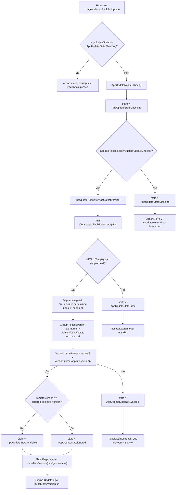
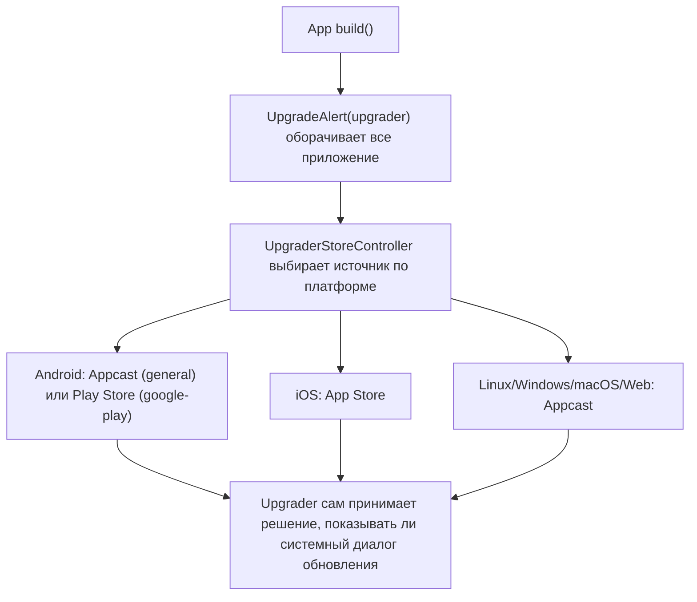

# ZEON: текущая схема обновлений приложения

Дата актуализации: 2026-05-13

Документ описывает текущее поведение проверки обновлений в кодовой базе (ручной запуск из About и авто-проверка через `UpgradeAlert`).

## 1) Блок-схема ручной проверки из About

## 2) Блок-схема авто-проверки в приложении (UpgradeAlert)

## 3) Как приложение понимает, что версия устарела

1. Текущая версия берется из `PackageInfo.fromPlatform()` как `appInfo.version` (например, `4.1.2`).
2. Удаленная версия берется из GitHub Releases API: `tag_name` парсится в `remote.version`.
3. Сравнение: `Version.parse(remote.version) > Version.parse(appInfo.version)`.
4. Если условие истинно, приложение считает локальную версию старой и переводит state в `available` или `ignored`.

Важно:
- В ручной проверке не участвует `buildNumber` при сравнении.
- Не учитывается платформа при выборе конкретного артефакта: в `RemoteVersionEntity.url` кладется `html_url` страницы релиза.
- Для `ignored` и `available` в About открывается один и тот же диалог (`canIgnore=false`).

## 4) План: остаемся на GitHub-схеме, переключаемся на ваш канал обновлений

1. Определить канал в рамках GitHub:
   - `stable`: GitHub Release с `prerelease=false`.
   - `beta` (опционально): GitHub Release с `prerelease=true`.
2. Закрепить отдельный GitHub-репозиторий/owner для канала ZEON (если нужно отделить от текущего).
3. Перенастроить URL-источники в коде:
   - `Constants.githubReleasesApiUrl`;
   - `Constants.githubLatestReleaseUrl`;
   - `Constants.appCastUrl`.
4. Обновить `appcast.xml` под ZEON-артефакты:
   - ссылки на ваши установщики/архивы по каждой платформе;
   - актуальные `sparkle:version` и `pubDate`;
   - исправить невалидный iOS URL (`hhttps://...`).
5. Синхронизировать релизный процесс:
   - сборка артефактов;
   - публикация GitHub Release с нужным `tag_name`;
   - обновление `appcast.xml` в том же релизном цикле.
6. Проверить обе цепочки обновления:
   - ручная проверка в About (GitHub Releases API);
   - авто-проверка `UpgradeAlert` (Appcast/Store по платформе).

## 5) Что нужно поменять в коде минимально

1. Обновить константы URL в [constants.dart](D:/YandexDisk/1CODING/zeon-app/lib/core/model/constants.dart).
2. Оставить текущий `AppUpdateRepository` и `GithubReleaseParser` без смены архитектуры.
3. Опционально добавить явный выбор канала:
   - для ручной проверки: переключать `includePreReleases`;
   - для авто-проверки: отдельный `appcast` URL для `stable/beta`.
4. Добавить smoke-тесты/чек-лист на релиз:
   - `checkForUpdate` на версии N и N-1;
   - проверка, что `Update now` открывает корректную ссылку.

## 6) Риски в текущей GitHub-схеме и как их закрыть

1. Риск: рассинхрон между GitHub Release и `appcast.xml`.
   - Мера: генерировать/обновлять `appcast.xml` автоматически в релизном пайплайне.
2. Риск: некорректные теги версий ломают парсинг.
   - Мера: зафиксировать формат `tag_name` и валидировать его в CI перед публикацией.
3. Риск: в ручной проверке сравнение только по `version`.
   - Мера: не выпускать разные сборки с одинаковым `version` и разным `buildNumber` в одном канале.
