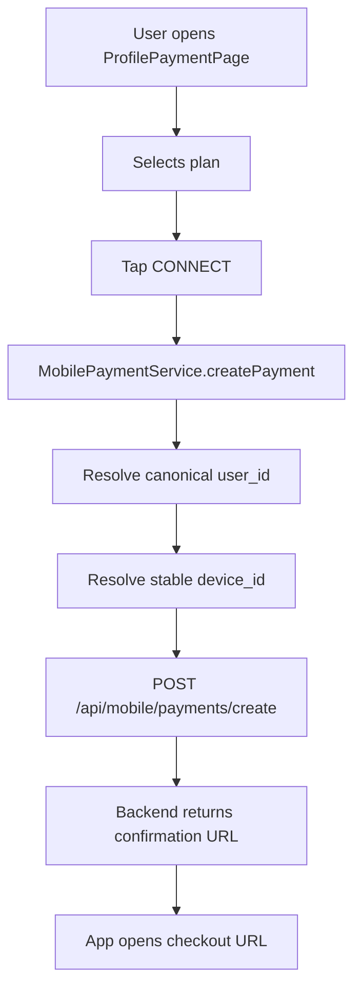

# Mobile payment flow (ProfilePaymentPage -> checkout)

Living document for payment in `com.zeon.hiddify`.

Goal: keep one canonical `user_id` across import/bind/payment and document current behavior, migration, and limits.

## Canonical user_id

- Canonical key in SharedPreferences: `mobile_auto_import_user_id`.
- Owner of canonical key: mobile bind/import chain (`MobileConnLinkImportService`, `MobileBindService`, `MobileBootstrapImportService`).
- Payment flow (`MobilePaymentService`) must use only this canonical `user_id`.

## Legacy key policy

- Legacy key: `mobile_payment_user_id`.
- Allowed only as migration fallback for old installs.
- On fallback hit, value is moved to canonical key and legacy key is removed.

## End-to-end flow

## user_id resolution algorithm in payment

`MobilePaymentService._ensureUserId()`:

1. Read `mobile_auto_import_user_id`.
2. If valid integer `> 0`:
- use it as payment `user_id`;
- remove `mobile_payment_user_id` if present (cleanup/mismatch protection).
3. Else read legacy `mobile_payment_user_id`.
4. If valid integer `> 0`:
- migrate to `mobile_auto_import_user_id`;
- remove legacy key;
- use migrated value.
5. Else call `POST /api/mobile/users/create` with `device_id`.
6. Save returned `user_id` to `mobile_auto_import_user_id` and use it for `/api/mobile/payments/create`.

## Import/bind chain and canonical user_id

`MobileConnLinkImportService.importConnectionLink(...)` now resolves user id in this order:

1. Explicit `userId` argument (bind/bootstrap path).
2. Numeric `openId` parsed from `/open/<id>` link.
3. If resolved id exists, save to `mobile_auto_import_user_id`.
4. If no id and `clearUserIdWhenMissing=true`, remove canonical key.

This guarantees that import through `open/<id>` writes the same id used later by payment.

## Payment request payload

`POST /api/mobile/payments/create` payload:

1. `user_id` (from canonical flow above)
2. `device_id` (from `StableDeviceIdService`)
3. `plan` (`1|3|6|12` as int, or `"trial"`)

## Runtime logs to verify sync

`MobilePaymentService` logs:

- `mobile payment user_id resolved [source=canonical ...]`
- `mobile payment user_id migrated from legacy key ...`
- `mobile payment create request prepared [canonical_user_id=..., ...]`
- `mobile payments/create attempt [user_id=..., ...]`

`MobileConnLinkImportService` logs (for open-link path):

- `mobile conn_link import: canonical user_id resolved from open_id [user_id=...]`

## Current limitations and risks

1. Payment success callback/status is still backend-driven; app does not finalize payment state directly after checkout return.
2. For imports without explicit/numeric user id, canonical key may be cleared when `clearUserIdWhenMissing=true`.
3. Checkout details (`return_url`, YooKassa params, etc.) remain fully backend-controlled by `/api/mobile/payments/create`.

## Key files

- `lib/features/mobile/data/mobile_payment_service.dart`
- `lib/features/mobile/data/mobile_conn_link_import_service.dart`
- `lib/features/mobile/data/mobile_bind_service.dart`
- `lib/features/mobile/data/mobile_bootstrap_import_service.dart`
- `lib/features/profile/overview/profile_payment_page.dart`
