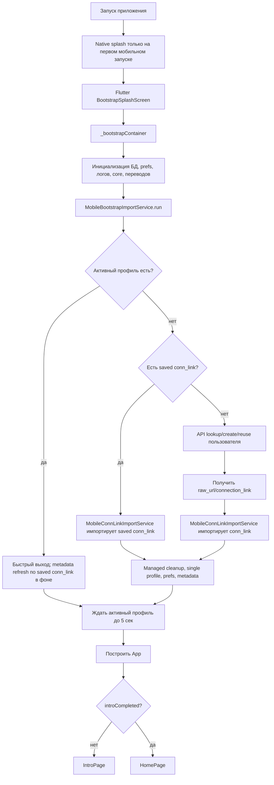

# Mobile startup and account import flow

Живой документ по бизнес-цепочке мобильного приложения `com.zeon.hiddify`.

Цель: фиксировать общие термины, пользовательские сценарии, внутренние алгоритмы и бэкенд-вызовы. После изменений в запуске, Intro, импорте профиля, привязке аккаунта или хранении managed-профиля этот файл нужно обновлять в той же правке.

## Термины

- Пользователь: человек, который запускает приложение и должен получить рабочий VPN-профиль.
- Профиль: запись `ProfileEntries` и соответствующий файл конфигурации, который импортируется через `ProfileRepository.upsertRemote(...)`.
- Активный профиль: профиль, который сейчас выбран в приложении. Технически это запись `ProfileEntries` с `active = true`; приложение ожидает один такой профиль.
- Managed-профиль: профиль, который приложение получило через мобильную цепочку `bootstrap`, ручной импорт `conn_link` или bind confirm и дальше считает управляемым. Приложение может заменить этот профиль новым импортом, удалить старый managed-профиль, удалить лишние профили и сохранить id текущего managed-профиля в `mobile_managed_profile_id`.
- `api_link`: базовый адрес мобильного API из `mobile_api_base_url`. Используется и для backend API (`/api/v1/...`, `/bind/...`), и как host основного импортируемого `conn_link`.
- `conn_link`: основной импортируемый URL профиля в формате `api_link/open/$openId`. Пример: `https://130.49.151.173/open/649669380`. В API рядом могут встречаться поля `connection_link`, `raw_url`, `conn_link` или технический `subscriptionUrl`; входные `/open/$openId` и публичные ссылки нормализуются к основному `conn_link`.
- Публичная open-ссылка: `https://zeon-vps.link/open/$openId`. Это fallback, если основной `api_link/open/$openId` недоступен, возвращает 404 или импорт по нему не проходит.
- `subscriptionUrl`: технический URL из `<script id="zeon-data">`, который может указывать на фактическую подписку. Это не бизнес-термин и не заменяет `conn_link`.
- `user_id`: id пользователя в мобильном API. Хранится в `mobile_auto_import_user_id`, если был получен через авто-импорт или bind confirm.
- Каноническое правило (обновлено 11 мая 2026): при импорте `open/<id>` `MobileConnLinkImportService` извлекает numeric `openId` и сохраняет его в `mobile_auto_import_user_id`; далее этот же ключ должен использоваться в оплате.
- `device_id`: стабильный id устройства. Берется из SharedPreferences, Android/iOS native id, secure storage или генерируется как UUID.
- Manual rebind sync: best-effort POST `/api/v1/devices/rebind` после успешного ручного импорта в Intro, чтобы зафиксировать серверную привязку `device_id -> owner_user_id` для восстановления после `pm clear`/переустановки.
- Intro completed: флаг `Preferences.introCompleted`; отвечает только за то, показывать Intro или сразу Home. Не равен факту наличия профиля.

## Блок-схема первого запуска

## 1. Запуск приложения

Точка входа: `lib/main.dart` / `lib/main_prod.dart` вызывают `lazyBootstrap(...)`.

`lazyBootstrap(...)`:

1. Проверяет, нужно ли сохранить native splash.
2. Показывает `_BootstrapHost`.
3. `_BootstrapHost` после первого frame запускает `_bootstrapContainer(...)`.
4. Пока `_bootstrapContainer` не завершился, пользователь видит `BootstrapSplashScreen`.
5. После bootstrap создается основной `App`, GoRouter решает: `/intro` или `/home`.

Важно: GoRouter стартует с `/home`, но redirect отправляет на `/intro`, если `Preferences.introCompleted == false`.

## 2. Прелоадер и timeout

Видимый прелоадер: `BootstrapSplashScreen`.

Что происходит внутри:

1. Инициализируются директории, логгер, SharedPreferences, миграции prefs.
2. Инициализируются defaults, профильный репозиторий, переводы, hiddify-core.
3. На mobile вызывается `MobileBootstrapImportService.enforceSingleProfile()`.
4. Вызывается `MobileBootstrapImportService.run()` с timeout 90 секунд на чистом старте без профиля.
5. После этого bootstrap ждёт активный профиль до 5 секунд.
6. Запускаются фоновые повторы авто-импорта через 5, 10, 20 и 40 секунд.

Жесткая верхняя граница ожидания mobile auto import в прелоадере: 90 секунд, чтобы чистый пользователь успел пройти API create/reuse, импорт и metadata sync. Ручной импорт в Intro также ограничен 90 секундами. HTTP-клиент использует timeout 15 секунд и retry interceptor.

Если `mobile_auto_import_done = true` и активный профиль есть, `MobileBootstrapImportService` быстро выходит без blocking API/import. Metadata refresh по сохраненному `conn_link` запускается best-effort в фоне с коротким timeout и не держит старт приложения.

Если активный профиль уже есть, приложение также быстро выходит из mobile bootstrap без blocking API/import даже при отсутствующем done-флаге. Для уже подготовленного пользователя цель старта - просто открыть приложение, а не повторять создание/импорт профиля.

## 3. MobileConnLinkImportService

Файл: `lib/features/mobile/data/mobile_conn_link_import_service.dart`.

Это единый владелец импорта `conn_link`. `MobileBootstrapImportService`, `IntroPage` и bind confirm не должны дублировать `_importFromConnLink`, `_resolveImportUrl`, cleanup managed-профиля или metadata sync.

Ответственность сервиса:

1. Нормализовать raw input, open id или URL.
2. Для `/open/$openId` строить primary `conn_link = api_link/open/$openId`.
3. Для того же `$openId` строить fallback `https://zeon-vps.link/open/$openId`.
4. Импортировать через `ProfileRepository.upsertRemote(...)`.
5. Для каждого candidate (`primary`, затем `fallback`) делать validate-проход:
   - `upsertRemote(default)`;
   - `upsertRemote(resolved/default)` по `subscriptionUrl` из `zeon-data`, если он есть;
   - `upsertRemote(directOnly)`;
   - `upsertRemote(resolved/directOnly)`;
   - те же шаги для `platform=hiddify`.
6. Только если validate-проход не дал результата ни для одного candidate, запускать no-validate-проход (`validateConfigOnImport: false`) с тем же порядком (`default -> resolved/default -> directOnly -> resolved/directOnly`) и также с вариантом `platform=hiddify`.
7. При провале primary и наличии fallback логировать предупреждение и переходить к `https://zeon-vps.link/open/$openId`.
8. Заменять предыдущий managed-профиль на активный импортированный профиль.
9. Удалять лишние профили, оставляя один активный.
10. Синхронизировать metadata: name/login, status, expires_at, webPageUrl, supportUrl.
11. Сохранять prefs:
    - `mobile_auto_import_done`
    - `mobile_auto_import_conn_link`
    - `mobile_managed_profile_id`
    - `mobile_auto_import_user_id`, если он известен.

Порядок для open-ссылки:

1. Построить candidates: `primary = api_link/open/$openId`, `fallback = https://zeon-vps.link/open/$openId`.
2. Прогнать validate-проход по `primary` и затем по `fallback`:
   - `default -> resolved/default -> directOnly -> resolved/directOnly`;
   - для каждого шага также вариант `platform=hiddify`.
3. Если validate-проход неуспешен на всех candidates, прогнать второй no-validate-проход (`validateConfigOnImport: false`) в том же порядке.
4. Если primary не импортировался и есть fallback, фиксировать warning про переключение на fallback.
5. При сохранении `mobile_auto_import_user_id` приоритет источников такой:
   - сначала явный `userId` из аргумента `importConnectionLink(...)`;
   - если его нет, используется numeric `openId` из `/open/<id>`;
   - если оба отсутствуют и `clearUserIdWhenMissing=true`, ключ `mobile_auto_import_user_id` удаляется.

В `mobile_auto_import_conn_link` сохраняется основной `conn_link` (`api_link/open/$openId`), даже если конкретный импорт прошел через public fallback.

## 3.1 MobileDeviceRebindService

Файл: `lib/features/mobile/data/mobile_device_rebind_service.dart`.

После успешного ручного импорта в Intro приложение делает best-effort синхронизацию серверной привязки устройства:

- endpoint: `POST {mobile_api_base_url}/api/v1/devices/rebind`
- headers:
  - `x-api-key: {mobile_api_key}`
  - `Content-Type: application/json`
- body:
  - `device_id`: стабильный id из `StableDeviceIdService`
  - `owner_user_id`: numeric `user_id` (или numeric `openId`, если явного `user_id` нет)
  - `conn_link`: primary `api_link/open/$openId`
  - `source`: `manual_import`
  - `platform`: `android|ios|windows|macos|linux|unknown`

Поведение:

1. Если из ручного ввода нельзя получить numeric `user_id/openId`, rebind пропускается.
2. Таймаут rebind: 15 секунд.
3. Ошибка endpoint, timeout или отсутствие backend не откатывают локальный импорт профиля: это warning и best-effort.
4. При успехе сохраняются prefs:
   - `mobile_manual_rebind_done`
   - `mobile_manual_rebind_user_id`
   - `mobile_manual_rebind_conn_link`

## 4. MobileBootstrapImportService

Файл: `lib/features/mobile/data/mobile_bootstrap_import_service.dart`.

Ответственность сервиса: подготовить managed-профиль до входа пользователя в основное приложение и сохранить белый старт с созданием пользователя через API.

Алгоритм `runOrThrow()`:

1. Если web - сразу `false`.
2. Если активный профиль есть:
   - запускает metadata refresh по saved `conn_link` в фоне, если активный профиль выглядит managed;
   - возвращает `false`, без blocking API/import.
3. Если done-флаг есть, но активного профиля нет, считает состояние сломанным и пробует импорт заново.
4. Если есть saved `mobile_auto_import_conn_link`, импортирует его через `MobileConnLinkImportService`.
5. Если есть saved `mobile_auto_import_user_id`, делает lookup:
   - `GET /api/v1/subscriptions/lookup?user_id=<id>`
   - headers: `x-api-key`.
6. Если `conn_link` еще нет, создает или переиспользует пользователя:
   - `POST /api/v1/users/create`
   - body: `device_id`, `platform`, `subscription.create_if_missing = true`, опционально `user.user_id`.
7. Если после create есть `user_id`, но `conn_link` нет, повторяет lookup.
8. Передает `raw_url`/`connection_link` в `MobileConnLinkImportService`, который нормализует open-ссылку в primary `api_link/open/$openId`.

На абсолютном белом старте пользователя всё ещё нужно создавать через API, чтобы новый пользователь автоматически получил профиль.
После `pm clear`/переустановки bootstrap остается прежним: сервер по `device_id` должен вернуть актуальную серверную привязку. Если backend применил `devices/rebind`, вернется последний вручную выбранный `owner_user_id`.

## 5. MobileBindService

Файл: `lib/features/mobile/data/mobile_bind_service.dart`.

Сервис оставлен для bind-session API:

- `createSession()` -> `POST /bind/session/create`
- `confirmCode(bindCode)` -> `POST /bind/session/confirm`
- `getStatus(bindSessionId)` -> `GET /bind/session/status`
- `cancelSession(bindSessionId)` -> `POST /bind/session/cancel`
- `connectSessionEvents(bindSessionId)` -> WebSocket `/ws/bind`

Для этих методов нужен JWT. JWT берется из prefs/env или обновляется через:

- `POST /api/v1/bind/token`
- при необходимости устройство регистрируется через `POST /api/v1/users/create`.

`MobileBindService` больше не владеет импортом профиля. Если `confirmCode(...)` когда-либо используется и получает `conn_link`, он делегирует импорт в `MobileConnLinkImportService`.

TODO: текущая Intro-цепочка не вызывает bind-session методы. Если bind-session сценарий не вернется в UI, сервис можно изолировать или архивировать отдельно.

## 6. IntroPage

Файл: `lib/features/intro/widget/intro_page.dart`.

Intro открывается, когда `Preferences.introCompleted == false`.

При построении страницы:

1. Регион ставится в `Region.other`. Автоугадывание региона по timezone/IP отключено.
2. Профиль в самой IntroPage явно не запрашивается.
3. Предполагается, что bootstrap уже попытался подготовить активный профиль.

### 6.1 Кнопка "Стартуем"

Фактическое действие:

1. Ставит `Preferences.introCompleted = true`.
2. Делает `context.goNamed('home')`.

Кнопка не запускает импорт профиля. Если bootstrap не успел получить профиль или импорт упал, Home может открыться без активного профиля.

### 6.2 "Я уже имею аккаунт"

Фактическое действие:

1. Открывается `_BindAccountCodeDialog`.
2. Пользователь вводит `conn_link`, public open-ссылку или open id.
3. Dialog валидирует ввод как ссылку/код.
4. Вызывает `MobileConnLinkImportService.importConnectionLink(rawInput).timeout(90 секунд)`. Для ввода вида `/open/<id>` этот шаг дополнительно записывает канонический `mobile_auto_import_user_id` из numeric `openId`.
5. При успехе:
   - делает best-effort `MobileDeviceRebindService.syncManualImportRebind(...).timeout(15 секунд)`; ошибка rebind не ломает импорт;
   - показывает success toast;
   - ставит `Preferences.introCompleted = true`;
   - закрывает dialog;
   - переходит на Home.
6. При ошибке показывает toast с mapped error.

Пример `https://zeon-vps.link/open/649669380`:

1. Dialog распознает `/open/649669380`.
2. `MobileConnLinkImportService` строит primary `https://130.49.151.173/open/649669380`.
3. Пытается импортировать primary как remote profile.
4. Если primary недоступен/404/не импортируется, пробует `https://zeon-vps.link/open/649669380`.
5. Если импорт успешен, профиль становится активным и сохраняется как managed-профиль.

### 6.3 Итоговая цепочка восстановления после переустановки

1. Пользователь вручную импортирует новую ссылку в Intro (`MobileConnLinkImportService`).
2. После успешного локального импорта запускается best-effort rebind в backend (`MobileDeviceRebindService`, `POST /api/v1/devices/rebind`).
3. При `pm clear`/переустановке новый локальный профиль отсутствует, и bootstrap снова идет через `/api/v1/users/create` с тем же `stable device_id`.
4. Если серверный rebind ранее зафиксирован, backend возвращает уже нового владельца устройства, а `MobileConnLinkImportService` снова поднимает его профиль как активный.
5. Активный профиль сохраняется в репозитории профилей и используется для запуска background core/VPN (не только для отображения в UI).

## 7. Открытые вопросы и риски

- Нужно решить, является ли ввод `/open/<id>` бизнес-сценарием "импорт ссылки" или "bind confirm по коду". Сейчас это импорт ссылки, не `/bind/session/confirm`.
- Нужно решить, должен ли Home блокироваться, если после bootstrap нет активного профиля. Сейчас блокировки нет.
- `getByUrl` ищет через `LIKE '%url%'`, поэтому совпадения URL могут быть нестрогими.
- `_safeInit(... timeout ...)` не отменяет исходный Future. При timeout bootstrap продолжит, а исходный импорт может завершиться позже.
- Если primary `api_link/open/$openId` стабильно недоступен, импорт пройдет через public fallback, но сохраненный `conn_link` останется primary. Это сделано намеренно по бизнес-терминологии.
- Если backend еще не реализовал `/api/v1/devices/rebind`, переустановка может вернуть старую server-side привязку `device_id -> user`, даже при успешном локальном ручном импорте.

## Ключевые файлы

- `lib/bootstrap.dart`
- `lib/features/bootstrap/widget/bootstrap_splash_screen.dart`
- `lib/features/intro/widget/intro_page.dart`
- `lib/features/mobile/data/mobile_conn_link_import_service.dart`
- `lib/features/mobile/data/mobile_device_rebind_service.dart`
- `lib/features/mobile/data/mobile_bootstrap_import_service.dart`
- `lib/features/mobile/data/mobile_bind_service.dart`
- `lib/features/mobile/data/stable_device_id_service.dart`
- `lib/features/profile/data/profile_repository.dart`
- `lib/features/profile/data/profile_data_source.dart`
- `lib/core/router/go_router/routing_config_notifier.dart`
- `lib/core/preferences/general_preferences.dart`
