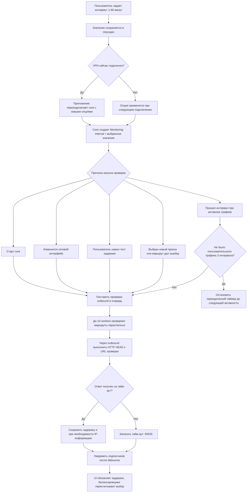

# Интервал теста URL: поведение приложения и рекомендации

## Краткий ответ

**Интервал теста URL** задает, как часто core приложения повторно проверяет доступность
маршрутов через прокси и обновляет измеренную задержку. В интерфейсе значение можно
выставить от **1 до 60 минут**, значение по умолчанию: **3 минуты**.

Это не ICMP-ping сервера и не измерение скорости загрузки. Core открывает соединение
через проверяемый outbound и отправляет HTTP `HEAD`-запрос к URL проверки. Результат
следует воспринимать как практический индикатор: может ли маршрут сейчас работать и
насколько быстро он отвечает на короткий запрос.

Настройка не связана с интервалом обновления подписки. Обновление подписки загружает
новый список серверов, а тест URL проверяет уже загруженные маршруты.

## Польза для пользователя

Периодический тест дает приложению актуальные данные для трех задач:

1. Показывать задержку или тайм-аут рядом с прокси.
2. Быстрее исключать недоступные маршруты из полезного набора.
3. Обновлять выбор маршрута в балансировщиках, включая вариант с минимальной
   задержкой.

Чем меньше интервал, тем быстрее приложение замечает деградацию, но тем чаще создает
служебный трафик и дополнительную нагрузку на устройство и серверы.

## Блок-схема



## Как настройка проходит через приложение

| Этап | Реализация |
| --- | --- |
| UI | `GeneralPage` показывает настройку и slider `1..60` минут. |
| Значение по умолчанию | Flutter-слой использует `Duration(minutes: 3)`. |
| Хранение | Значение сериализуется в секунды под ключом `url-test-interval`. |
| Применение | Изменение config options при активном подключении планирует переподключение. |
| Сборка core-конфига | В штатном пути значение становится `experimental.monitoring.interval`. |
| Пауза при простое | `idle_timeout` задается как `interval * 3`. |
| Обновление UI | Monitoring публикует события с debounce `500 ms`, hcore дополнительно объединяет обновления за `1000 ms`. |

Пример при стандартной настройке:

```json
{
  "experimental": {
    "monitoring": {
      "interval": "3m0s",
      "debounce_window": "500ms",
      "idle_timeout": "9m0s"
    }
  }
}
```

## Что происходит во время проверки

### Автоматический цикл

При старте core мониторинг запускает цикл сразу. Далее цикл повторяется по интервалу,
пока есть пользовательский трафик. Если трафика нет в течение трех интервалов,
периодический таймер останавливается. Следующая маршрутизируемая пользовательская
активность запускает его снова.

Регулярный цикл проверяет leaf-outbound, результат которого отсутствует, устарел или
помечен невалидным. Группы сами не тестируются: core доходит до входящих в них
маршрутов.

### Ручной цикл

Пользователь может не ждать таймер:

- кнопка с молнией на экране прокси запускает тест группы `select`;
- нажатие на индикатор задержки активного прокси запускает тест активного маршрута;
- выбор нового прокси также инициирует проверку выбранного маршрута.

Запрос теста активного leaf-маршрута ставится в приоритетную очередь. При ручном
тесте группы core раскрывает группу и ставит ее дочерние маршруты в обычную очередь.

### URL и fallback

В UI задается основной `connection-test-url`. В штатной сборке core добавляет fallback:

1. URL, выбранный пользователем или переданный профилем;
2. `https://zeon-vps.link/generate_204`;
3. `http://captive.apple.com/generate_204`;
4. `https://cp.cloudflare.com`;
5. `https://google.com/generate_204`.

Значение по умолчанию во Flutter UI:
`https://1.1.1.1`.

На момент проверки `https://1.1.1.1` быстро возвращает `301 Moved Permanently` на
`https://one.one.one.one/`. Текущая реализация URL-теста не следует редиректу и
считает успешным любой полученный HTTP-ответ, поэтому этот адрес подходит как
базовая проверка доступности маршрута.

Собственный резервный endpoint `https://zeon-vps.link/generate_204` обслуживается
напрямую nginx и для `GET` и `HEAD` возвращает `204 No Content` без редиректа и тела
ответа.

Если весь этап не дал ни одного успешного результата, monitoring переходит к
следующему URL. Если основной домен не резолвится или считается заблокированным,
core оставляет только его и не добавляет fallback.

Профиль подписки может переопределить `connection-test-url`, но не
`url-test-interval`.

### Значение задержки

В штатном конфиге включен `unified_delay`. Поэтому core делает два HTTP `HEAD`-запроса
по одному установленному соединению и использует время второго ответа. Это уменьшает
влияние установки соединения на число в UI.

Monitoring ограничивает один URL-тест тайм-аутом **5 секунд**. Реализация считает
маршрут доступным при получении HTTP-ответа и сейчас не требует конкретного статуса
`204`.

При первом актуальном тесте маршрута core также может запросить IP-информацию через
внешний сервис. Если такой запрос оказался быстрее, его время может стать итоговым
значением задержки. Поэтому число в UI: полезный сравнительный score маршрутов, но
не точное измерение RTT до прокси-сервера.

Неуспешная проверка записывается как `65535`; UI показывает такой результат как
тайм-аут или знак `×`. Загруженный из кэша результат временно отображается как
неизмеренный до свежей проверки.

## Нагрузка

Обозначим количество проверяемых leaf-outbound как `N`.

Успешный обычный цикл с `unified_delay` создает примерно `2 * N` коротких HTTP `HEAD`-запросов.
На первом свежем цикле могут добавиться запросы IP-информации. Если URL проверки
недоступен для всех маршрутов, core может выполнить до пяти этапов с разными URL.

Проверки выполняются параллельно, по умолчанию до 10 workers. Поэтому слишком
маленький интервал особенно заметен на профилях с большим количеством серверов.

## Рекомендуемые настройки

| Сценарий | Интервал | Комментарий |
| --- | --- | --- |
| Обычное использование в целевых нестабильных сетях | **3 минуты** | Рекомендуемое значение по умолчанию. Быстро замечает деградацию маршрутов. |
| Более стабильная сеть | **5-10 минут** | Снижает служебный трафик, сохраняя достаточно частое обновление доступности. |
| Стабильная домашняя или офисная сеть | **15-30 минут** | Снижает служебный трафик. Ручной тест остается доступен. |
| Экономия батареи и трафика | **30-60 минут** | Подходит при стабильных серверах и редкой необходимости автоматического переключения. |
| Диагностика | **1-2 минуты временно** | Удобно для наблюдения за проблемой, но не рекомендуется как постоянная настройка. |

Для продукта в условиях повышенной нестабильности сетей разумно использовать
**3 минуты** как стандартное значение. Пользователи со стабильной сетью могут
увеличить интервал до **5-10 минут**.

## Рекомендации по URL проверки

1. Для основной проверки предпочтителен небольшой стабильный endpoint с ответом
   `204 No Content`, доступный из целевых регионов.
2. Для более строгой проверки доступности интернета лучше использовать HTTPS.
   HTTP полезен для диагностики captive portal, но перехват или подмена HTTP-ответа
   может создать ложное впечатление, что маршрут исправен.
3. Не стоит использовать тяжелую веб-страницу: core делает `HEAD`, но endpoint все
   равно должен быть быстрым и предсказуемым.
4. Собственный HTTPS endpoint `https://zeon-vps.link/generate_204` сохранен как
   fallback без редиректов, cookies и персонализированного ответа.
5. Изменение URL следует оценивать из реальных целевых сетей: один глобально известный
   домен может быть недоступен у части пользователей.

## Выводы для развития приложения

1. **Переименовать настройку в UI.** Текущее название «Интервал теста URL» технически
   верное, но не объясняет пользу. Более понятный вариант:
   **«Интервал проверки доступности серверов»**. Подсказка:
   «Как часто обновлять задержку и доступность маршрутов. Меньший интервал быстрее
   замечает проблемы, но увеличивает служебный трафик».
2. **Отвязать monitoring от Clash API.** Сейчас `experimental.monitoring` с
   пользовательским интервалом создается только при `enable-clash-api = true`.
   Если Clash API отключить, сам monitoring все равно запускается, но использует
   внутренний default `5m`, а выбранное в UI значение фактически игнорируется.
3. **Добавить тесты передачи настройки.** Нужны проверки:
   `3 минуты -> monitoring.interval = 3m`, `idle_timeout = 9m`, а также сценарий
   `enable-clash-api = false`.
4. **Показывать пояснение для URL.** Пользователю полезно знать, что это адрес
   контрольного запроса, а не URL подписки.
5. **Рассмотреть пресеты.** Для большинства пользователей проще выбрать
   «Экономно: 30 минут», «Сбалансированно: 10 минут», «Быстро: 3 минуты», сохранив
   ручную настройку в расширенном режиме.
6. **Определить критерий успешного HTTP-ответа.** Сейчас URL-тест принимает любой
   HTTP-ответ. Для собственного контрольного endpoint стоит проверять ожидаемый
   статус `204`, чтобы уменьшить число ложноположительных результатов.

## Важные границы анализа

- Документ описывает текущий штатный путь сборки ZEON/sing-box конфига.
- В репозитории также встречается Xray `burstObservatory.pingConfig.interval`.
  Это отдельный механизм импортированного Xray-конфига; настройка Flutter
  `url-test-interval` не является его прямым регулятором.
- В локальном sing-box осталась старая реализация outbound типа `urltest` с default
  `3m`. В текущем builder она закомментирована: вместо нее используются общий
  `Monitoring` и outbound типа `balancer`.

## Основные места в коде

- UI slider: `lib/features/settings/overview/sections/general_page.dart`
- Значение по умолчанию и хранение: `lib/features/settings/data/config_option_repository.dart`
- Сериализация в секундах: `lib/core/utils/json_converters.dart`
- Переподключение после изменения: `lib/features/settings/notifier/config_option/config_option_notifier.dart`
- Сборка `experimental.monitoring`: `hiddify-core/v2/config/builder.go`
- Реализация monitoring: `hiddify-core/zeon-sing-box/common/monitoring/outbound_monitoring.go`
- HTTP `HEAD`-тест: `hiddify-core/zeon-sing-box/common/urltest/urltest.go`
- Реакция балансировщика: `hiddify-core/zeon-sing-box/protocol/group/balancer/balancer.go`
- Передача результатов в UI: `hiddify-core/v2/hcore/proxy_info.go`
